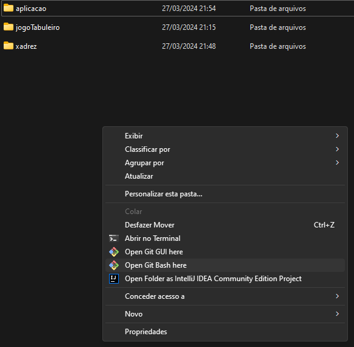
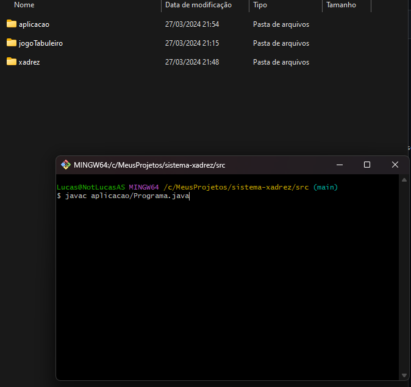
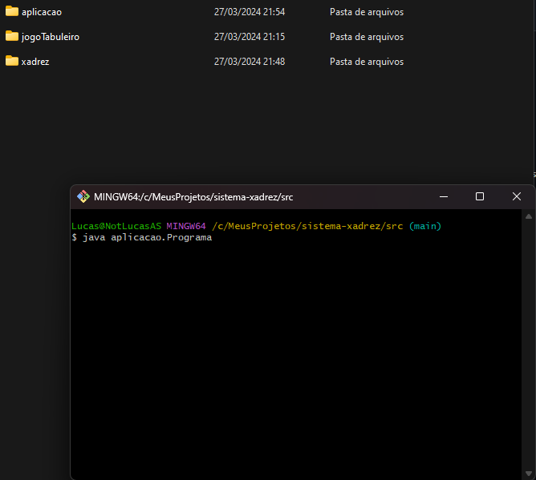
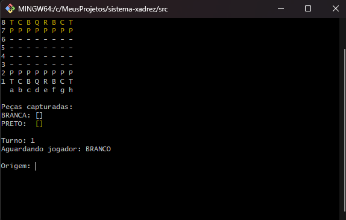

# Jogo de Xadrez 

Este programa é um projeto pessoal destinado a testar meu conhecimento de tudo o que foi aprendido em um curso de Java.
 ### Caso queira testar e joga na sua máquina siga os passo a seguir:

* Primeiro, clone o projeto para a sua máquina;
* Abra o projeto e navegue até a pasta \sistema-xadrez\src.
  
* Na pasta _src_ clique com o botão esquerdo no mouse e abra o terminal de sua preferência;
>usamos o Git Bash nesse exemplo:
> 
  

  > Observação: Alguns terminais podem não reconhecer caracteres especiais, como o Powershell e cmd. Isso não afeta a execução, mas pode resultar em algumas palavras não sendo exibidas corretamente ao serem lidas.
* Assim que o terminal estiver aberto, é necessário recompilar o projeto para que a pasta de execução principal seja reconhecida pelo terminal. Para fazer isso, execute o seguinte comando no terminal:
`javac aplicacao/Programa.java`

Este comando irá recompilar o arquivo **Programa.java** localizado na pasta aplicacao, garantindo que todas as dependências sejam atualizadas antes da execução.

Após seguir os passos anteriores, agora basta executar o programa principal. Para isso, no terminal, digite o seguinte comando:
`java aplicacao.Programa` Este comando irá iniciar a execução do programa principal, permitindo que você teste e explore a aplicação conforme necessário.

Após a execução, a tela de início do jogo será exibida conforme descrito abaixo: 

Agora é só começar a utilizar 